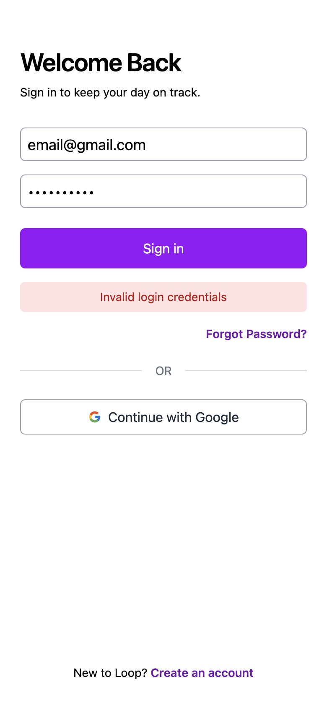
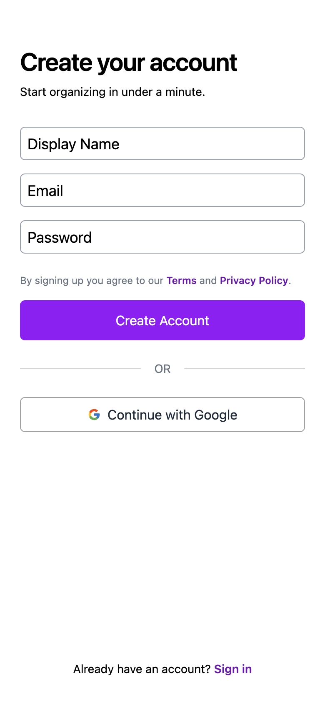
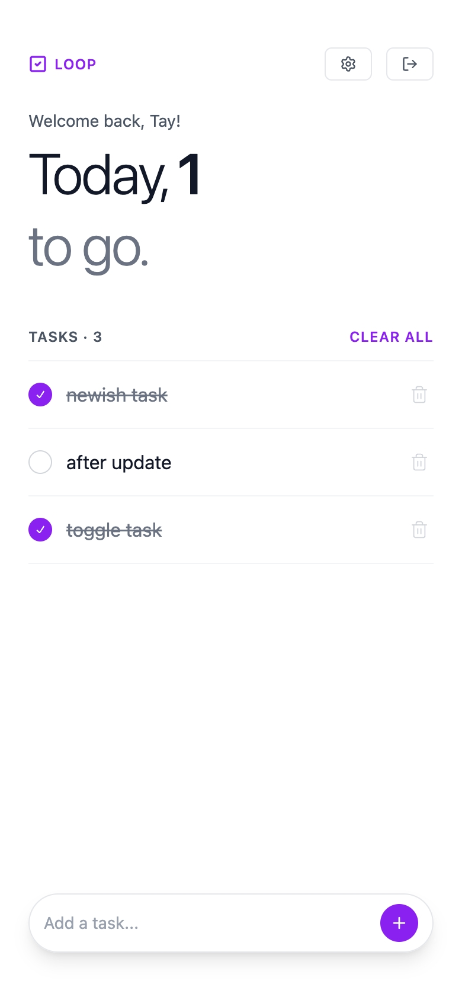
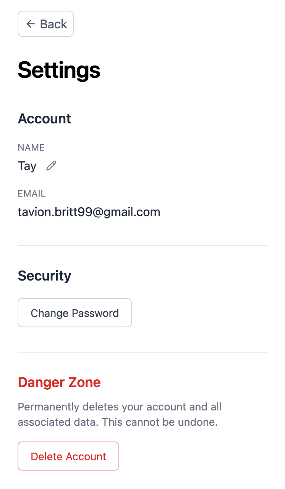

# Loop — Task Manager

A clean, minimal task manager built with React and TypeScript, featuring user authentication and cloud-synced tasks, styled with Tailwind CSS.

## Tech Stack

- **React** – Component-based UI with hooks (`useState`, `useEffect`, `useRef`)
- **TypeScript** – Fully typed components, props, and utility functions
- **Vite** – Fast dev server and build tooling
- **Tailwind CSS v4** – Utility-first styling
- **Supabase** – Auth (email/password + Google OAuth) and PostgreSQL task storage
- **React Router v6** – Client-side routing and protected routes
- **Radix UI** – Accessible, unstyled checkbox primitive
- **Lucide React** – Lightweight icon set
- **react-icons** – Google icon for OAuth button

## Features

- User authentication — sign up, log in, log out, forgot/reset password
- Google OAuth sign-in
- Add tasks with input validation
- Mark tasks as complete via an accessible Radix UI checkbox primitive
- Delete individual tasks
- Clear all completed tasks at once
- Clear all tasks with a single button
- Tasks are persisted to Supabase and synced across sessions
- Protected routes — unauthenticated users are redirected to `/login`

## Live Demo

## Screenshots

| Login | Sign Up | App | Settings |
|-------|---------|-----|----------|
|  |  |  |  |

## Project Structure

```
src/
├── components/
│   ├── Header.tsx         # Animated heading, task count, logout button
│   ├── AddTask.tsx        # Controlled input form, writes to Supabase
│   ├── TodoList.tsx       # Task list, bulk actions
│   ├── ListItem.tsx       # Individual task row
│   └── GoogleOAuth.tsx    # Google OAuth sign-in button
├── pages/
│   ├── Login.tsx          # Email/password login + Google OAuth
│   ├── Signup.tsx         # New account registration
│   ├── ForgotPassword.tsx # Password reset request
│   ├── UpdatePassword.tsx # Password reset confirmation
│   ├── Settings.tsx       # User account settings
│   ├── Terms.tsx          # Terms of service
│   └── PrivacyPolicy.tsx  # Privacy policy
├── utils/
│   └── tasks.ts           # Pure functions for task state logic + Task interface
├── supabaseClient.ts      # Supabase client initialisation
└── App.tsx                # Root component, routing, auth state, task loading
```

## Environment Variables

Create a `.env.local` file in the project root:

```
VITE_SUPABASE_URL=your_supabase_project_url
VITE_SUPABASE_ANON_KEY=your_supabase_anon_key
```

## Getting Started

```bash
# Install dependencies
npm install

# Run dev server
npm run dev

# Build for production
npm run build
```
